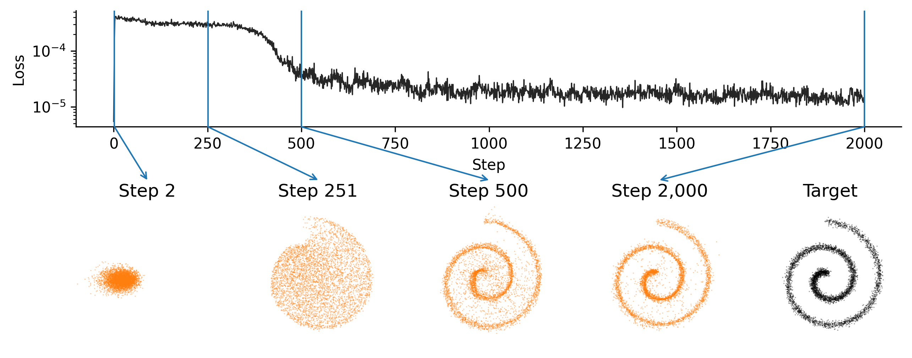

# Drifting Model in MLX

One-pass generative sampling via contrastive mean-shift drift fields.

Based on [Generative Models via Drifting Diffusion](https://arxiv.org/abs/2602.04770).



## Setup

```bash
uv sync
uv run main.py --help
options:
  -h, --help
  -d, --dataset {swiss_roll,checkerboard}
  --steps STEPS
  --lr LR
  --temp TEMP
  --x-batch-size X_BATCH_SIZE
  --y_batch_size Y_BATCH_SIZE
  --in-dim IN_DIM
  --hidden HIDDEN
  --seed SEED
  --n-snapshots N_SNAPSHOTS
```
